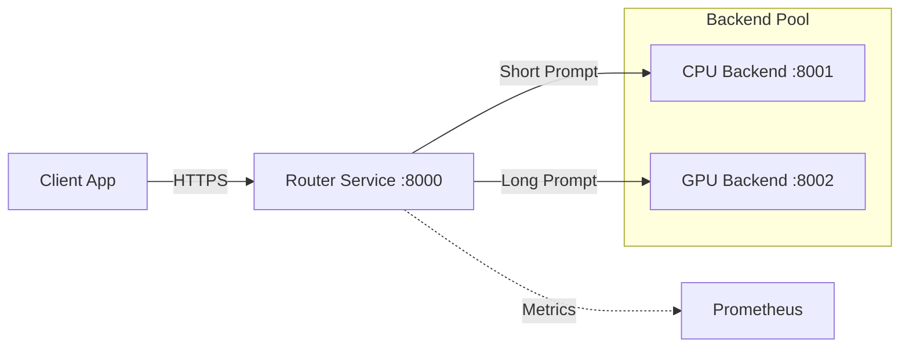

# Intelligent Request Router

[](https://github.com/anydockerhub/summy/actions)
[](https://opensource.org/licenses/MIT)
[](https://hub.docker.com/r/anydockerhub/summy)
[](CODE_OF_CONDUCT.md)

## Overview

The **Intelligent Request Router** is a high-performance, production-grade microservice designed to optimize LLM inference costs and latency. It acts as a smart reverse proxy that dynamically routes incoming chat completion requests to either a cost-efficient CPU backend or a high-throughput GPU backend based on prompt complexity.

By analyzing request payloads in real-time, this system ensures that short, simple queries are handled by lightweight CPU instances, while complex, long-context prompts are offloaded to specialized GPU clusters. This architecture significantly reduces infrastructure costs while maintaining low latency for all user interactions.

## Table of Contents

- [Overview](#overview)
- [Key Features](#key-features)
- [Architecture](#architecture)
- [Quick Start](#quick-start)
- [Configuration](#configuration)
- [API Reference](#api-reference)
- [Monitoring & Observability](#monitoring--observability)
- [CI/CD Pipeline](#cicd-pipeline)
- [Testing](#testing)
- [Deployment](#deployment)
- [Troubleshooting](#troubleshooting)
- [Contributing](#contributing)
- [Security](#security)
- [License](#license)

## Key Features

- **🧠 Intelligent Routing**: Automatically directs traffic based on prompt token length (threshold configurable).
- **⚡ High Performance**: Built with FastAPI and Uvicorn for non-blocking, asynchronous request handling.
- **🛡️ Production Ready**: Includes comprehensive health checks, graceful shutdowns, and structured logging.
- **📊 Observability**: Native Prometheus metrics export for monitoring throughput, latency, and routing decisions.
- **☁️ Cloud Native**: Fully containerized with Docker and ready for Kubernetes deployment with HPA support.
- **🔄 CI/CD Integrated**: Automated build and push pipelines via GitHub Actions.

## Architecture



### Component Roles

| Service | Port | Role |
| :--- | :--- | :--- |
| **Router (Proxy)** | `8000` | Entry point. Parses JSON, calculates length, routes request. |
| **CPU Backend** | `8001` | Handles prompts ≤ 100 characters. Optimized for cost. |
| **GPU Backend** | `8002` | Handles prompts > 100 characters. Optimized for speed on heavy loads. |

## Quick Start

### Prerequisites

- Docker & Docker Compose v2.0+
- Python 3.9+ (for local development)
- Make (optional, for convenience commands)

### Deployment with Docker Compose

The fastest way to run the entire stack locally:

```bash
# Copy environment example
cp .env.example .env

# Start all services
docker compose up -d
```

Verify services are running:
```bash
curl http://localhost:8000/health
# Output: {"status": "healthy", "service": "proxy"}
```

### Local Development

1. **Clone the repository**:
   ```bash
   git clone https://github.com/anydockerhub/summy.git
   cd summy
   ```

2. **Install dependencies**:
   ```bash
   python -m venv venv
   source venv/bin/activate
   pip install -r requirements.txt
   ```

3. **Run services individually**:
   ```bash
   # Terminal 1: CPU Backend
   python -m core.backend_cpu

   # Terminal 2: GPU Backend
   python -m core.backend_gpu

   # Terminal 3: Router
   python -m core.proxy
   ```

## Configuration

Environment variables can be set via `.env` file or directly in the shell.

| Variable | Default | Description |
| :--- | :--- | :--- |
| `HOST` | `0.0.0.0` | Host address to bind the service |
| `PORT` | `8000` | Port for the proxy service |
| `ROUTING_THRESHOLD` | `100` | Character count threshold to switch from CPU to GPU. |
| `CPU_BACKEND_URL` | `http://localhost:8001` | Endpoint for the CPU service. |
| `GPU_BACKEND_URL` | `http://localhost:8002` | Endpoint for the GPU service. |
| `LOG_LEVEL` | `INFO` | Logging verbosity (`DEBUG`, `INFO`, `WARNING`, `ERROR`). |
| `MAX_CONCURRENCY` | `10` | Maximum concurrent connections |
| `HEALTH_CHECK_PATH` | `/health` | Health check endpoint path |
| `PROMETHEUS_ENABLED` | `true` | Enable/disable metrics endpoint. |

## API Reference

### Send Chat Completion

**Endpoint**: `POST /v1/chat/completions`

**Request**:
```json
{
  "model": "summy-model",
  "messages": [
    {"role": "user", "content": "Hello, how are you?"}
  ]
}
```

**Response**:
```json
{
  "id": "chatcmpl-123",
  "object": "chat.completion",
  "choices": [
    {
      "message": {"role": "assistant", "content": "I am doing well!"},
      "finish_reason": "stop"
    }
  ],
  "usage": {"prompt_tokens": 5, "completion_tokens": 5, "total_tokens": 10},
  "metadata": {"routed_to": "cpu_backend", "latency_ms": 45}
}
```

### Generate (Legacy Endpoint)

**Endpoint**: `POST /generate`

**Request**:
```json
{
  "prompt": "Your prompt here"
}
```

**Response**:
```json
{
  "backend": "cpu",
  "result": "processed in 0.100s"
}
```

### Health Check

**Endpoint**: `GET /health`  
Returns `200 OK` if the service and its downstream connections are healthy.

### Metrics

**Endpoint**: `GET /metrics`  
Exposes Prometheus-compatible metrics including:
- `http_requests_total`: Total requests processed.
- `request_routing_duration_seconds`: Time taken to route requests.
- `backend_latency_seconds`: Latency of downstream backends.
- `routing_decisions_total`: Count of CPU vs GPU routing decisions.

To scrape metrics locally:
```bash
curl http://localhost:8000/metrics
```

## Monitoring & Observability

The system exports detailed metrics for integration with Prometheus/Grafana stacks.

**Key Dashboards Panels**:
1. **Routing Distribution**: Pie chart of CPU vs GPU traffic split.
2. **Latency Heatmap**: P95/P99 latency across different prompt sizes.
3. **Error Rates**: 4xx/5xx error rates per backend.

### Prometheus Configuration

The included Prometheus configuration (`prometheus/prometheus.yml`) automatically scrapes metrics from all services:

```yaml
scrape_configs:
  - job_name: 'proxy'
    static_configs:
      - targets: ['proxy:8000']
  - job_name: 'cpu-backend'
    static_configs:
      - targets: ['cpu-backend:8001']
  - job_name: 'gpu-backend'
    static_configs:
      - targets: ['gpu-backend:8002']
```

Access Prometheus UI at `http://localhost:9090` when running with Docker Compose.

## CI/CD Pipeline

This project uses GitHub Actions to automate building and pushing Docker images to Docker Hub.

**Workflow Triggers**:
- Push to `main` branch → Builds `latest` and `<commit-sha>` tags.
- Pull Request opened/updated → Builds `pr-<number>` tag for testing.

**Secrets Required**:
Configure these in your GitHub Repository Settings > Secrets:
- `DOCKER_USER`: Your Docker Hub username.
- `DOCKER_PASS`: Your Docker Hub access token or password.

For detailed setup instructions, see [.github/workflows/README.md](.github/workflows/README.md).

## Testing

Run the test suite using `pytest`:

```bash
# Run all tests
pytest

# Run with coverage
pytest --cov=core --cov-report=html

# Run specific test category
pytest -m "integration"

# Run smoke tests
make smoke
```

### Test Structure

- `tests/test_proxy.py`: Unit and integration tests for the proxy router
- `scripts/smoke_test.sh`: End-to-end smoke tests for deployed services

## Deployment

### Docker

```bash
# Build image
docker build -t anydockerhub/summy:latest .

# Run container
docker run -p 8000:8000 --env-file .env anydockerhub/summy:latest
```

### Kubernetes

Deploy to Kubernetes using the provided manifest:

```bash
kubectl apply -f k8s-deployment.yml
```

The deployment includes:
- Horizontal Pod Autoscaler (HPA) configuration
- Resource limits and requests
- Health check probes
- Service exposure

### Docker Compose

For local development and testing:

```bash
docker compose up -d
```

This starts:
- Proxy service (port 8000)
- CPU backend (port 8001)
- GPU backend (port 8002)
- Prometheus (port 9090)

## Troubleshooting

### Common Issues

**1. Connection Refused to Backends**
- Ensure CPU (`8001`) and GPU (`8002`) services are running before starting the Proxy.
- Check `CPU_BACKEND_URL` and `GPU_BACKEND_URL` environment variables.
- Verify network connectivity between containers in Docker Compose.

**2. High Latency on Short Prompts**
- Verify the routing threshold is set correctly. If too low, short prompts might be hitting the GPU queue unnecessarily.
- Check backend service logs for performance issues.

**3. Docker Build Failures**
- Ensure you are logged in: `docker login`.
- Check for architecture mismatches if deploying to ARM-based servers (e.g., Apple Silicon).
- Clear Docker cache: `docker system prune -a`

**4. Prometheus Not Scraping Metrics**
- Verify Prometheus configuration in `prometheus/prometheus.yml`
- Check that target services are healthy and accessible
- Review Prometheus logs: `docker compose logs prometheus`

### Logs

Access service logs:
```bash
# All services
docker compose logs -f

# Specific service
docker compose logs -f proxy
```

### Getting Help

- Check existing [GitHub Issues](https://github.com/anydockerhub/summy/issues)
- Read the [Contributing Guide](CONTRIBUTING.md)
- Report security issues following our [Security Policy](SECURITY.md)

## Contributing

We welcome contributions! Please read our [Contributing Guidelines](CONTRIBUTING.md) for details on:

- How to report bugs and suggest features
- Submitting pull requests
- Code style and testing requirements
- Our Code of Conduct

### Quick Contribution Steps

1. Fork the repository
2. Create a feature branch (`git checkout -b feature/amazing-feature`)
3. Make your changes and add tests
4. Run tests: `pytest`
5. Commit your changes (`git commit -m 'Add some amazing feature'`)
6. Push to the branch (`git push origin feature/amazing-feature`)
7. Open a Pull Request

## Security

We take security seriously. Please review our [Security Policy](SECURITY.md) for:
- How to report vulnerabilities responsibly
- Supported versions
- Security best practices

**Please do NOT report security vulnerabilities through public GitHub issues.**

## License

This project is licensed under the MIT License - see the [LICENSE](LICENSE) file for details.

## Acknowledgments

- Built with ❤️ by the Summy Team
- Inspired by the need for efficient LLM inference routing
- Thanks to all contributors and the open-source community

---

**Repository**: [github.com/anydockerhub/summy](https://github.com/anydockerhub/summy)  
**Docker Hub**: [hub.docker.com/r/anydockerhub/summy](https://hub.docker.com/r/anydockerhub/summy)
