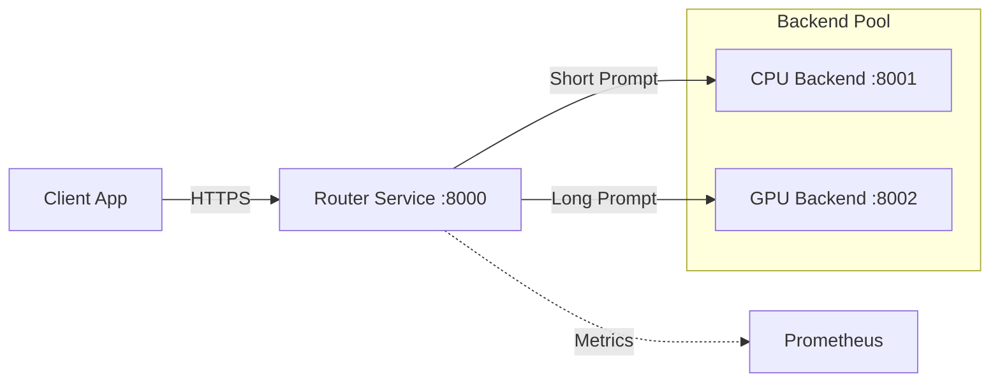

# Intelligent Request Router

[](https://github.com/anydockerhub/summy/actions)
[](https://opensource.org/licenses/MIT)
[](https://hub.docker.com/r/anydockerhub/summy)

## Overview

The **Intelligent Request Router** is a high-performance, production-grade microservice designed to optimize LLM inference costs and latency. It acts as a smart reverse proxy that dynamically routes incoming chat completion requests to either a cost-efficient CPU backend or a high-throughput GPU backend based on prompt complexity.

By analyzing request payloads in real-time, this system ensures that short, simple queries are handled by lightweight CPU instances, while complex, long-context prompts are offloaded to specialized GPU clusters. This architecture significantly reduces infrastructure costs while maintaining low latency for all user interactions.

## Key Features

- **🧠 Intelligent Routing**: Automatically directs traffic based on prompt token length (threshold configurable).
- **⚡ High Performance**: Built with FastAPI and Uvicorn for non-blocking, asynchronous request handling.
- **🛡️ Production Ready**: Includes comprehensive health checks, graceful shutdowns, and structured logging.
- **📊 Observability**: Native Prometheus metrics export for monitoring throughput, latency, and routing decisions.
- **☁️ Cloud Native**: Fully containerized with Docker and ready for Kubernetes deployment with HPA support.
- **🔄 CI/CD Integrated**: Automated build and push pipelines via GitHub Actions.

## Architecture



### Component Roles

| Service | Port | Role |
| :--- | :--- | :--- |
| **Router (Proxy)** | `8000` | Entry point. Parses JSON, calculates length, routes request. |
| **CPU Backend** | `8001` | Handles prompts ≤ 100 characters. Optimized for cost. |
| **GPU Backend** | `8002` | Handles prompts > 100 characters. Optimized for speed on heavy loads. |

## Quick Start

### Prerequisites

- Docker & Docker Compose v2.0+
- Python 3.9+ (for local development)
- Make (optional, for convenience commands)

### Deployment with Docker Compose

The fastest way to run the entire stack locally:

```bash
docker compose up -d
```

Verify services are running:
```bash
curl http://localhost:8000/health
# Output: {"status": "healthy", "service": "proxy"}
```

### Local Development

1. **Clone the repository**:
   ```bash
   git clone https://github.com/anydockerhub/summy.git
   cd summy
   ```

2. **Install dependencies**:
   ```bash
   python -m venv venv
   source venv/bin/activate
   pip install -r requirements.txt
   ```

3. **Run services individually**:
   ```bash
   # Terminal 1: CPU Backend
   uvicorn app.cpu_backend:app --port 8001

   # Terminal 2: GPU Backend
   uvicorn app.gpu_backend:app --port 8002

   # Terminal 3: Router
   uvicorn app.proxy:app --port 8000
   ```

## Configuration

Environment variables can be set via `.env` file or directly in the shell.

| Variable | Default | Description |
| :--- | :--- | :--- |
| `ROUTING_THRESHOLD` | `100` | Character count threshold to switch from CPU to GPU. |
| `CPU_BACKEND_URL` | `http://localhost:8001` | Endpoint for the CPU service. |
| `GPU_BACKEND_URL` | `http://localhost:8002` | Endpoint for the GPU service. |
| `LOG_LEVEL` | `INFO` | Logging verbosity (`DEBUG`, `INFO`, `WARNING`, `ERROR`). |
| `PROMETHEUS_ENABLED` | `true` | Enable/disable metrics endpoint. |

## API Reference

### Send Chat Completion

**Endpoint**: `POST /v1/chat/completions`

**Request**:
```json
{
  "model": "summy-model",
  "messages": [
    {"role": "user", "content": "Hello, how are you?"}
  ]
}
```

**Response**:
```json
{
  "id": "chatcmpl-123",
  "object": "chat.completion",
  "choices": [
    {
      "message": {"role": "assistant", "content": "I am doing well!"},
      "finish_reason": "stop"
    }
  ],
  "usage": {"prompt_tokens": 5, "completion_tokens": 5, "total_tokens": 10},
  "metadata": {"routed_to": "cpu_backend", "latency_ms": 45}
}
```

### Health Check

**Endpoint**: `GET /health`  
Returns `200 OK` if the service and its downstream connections are healthy.

### Metrics

**Endpoint**: `GET /metrics`  
Exposes Prometheus-compatible metrics including:
- `http_requests_total`: Total requests processed.
- `request_routing_duration_seconds`: Time taken to route requests.
- `backend_latency_seconds`: Latency of downstream backends.
- `routing_decisions_total`: Count of CPU vs GPU routing decisions.

## Monitoring & Observability

The system exports detailed metrics for integration with Prometheus/Grafana stacks.

**Key Dashboards Panels**:
1. **Routing Distribution**: Pie chart of CPU vs GPU traffic split.
2. **Latency Heatmap**: P95/P99 latency across different prompt sizes.
3. **Error Rates**: 4xx/5xx error rates per backend.

To scrape metrics locally:
```bash
curl http://localhost:8000/metrics
```

## CI/CD Pipeline

This project uses GitHub Actions to automate building and pushing Docker images to Docker Hub.

**Workflow Triggers**:
- Push to `main` branch → Builds `latest` and `<commit-sha>` tags.
- Pull Request opened/updated → Builds `pr-<number>` tag for testing.

**Secrets Required**:
Configure these in your GitHub Repository Settings > Secrets:
- `DOCKER_USER`: Your Docker Hub username.
- `DOCKER_PASS`: Your Docker Hub access token or password.

## Testing

Run the test suite using `pytest`:

```bash
# Run all tests
pytest

# Run with coverage
pytest --cov=app --cov-report=html

# Run specific test category
pytest -m "integration"
```

## Troubleshooting

### Common Issues

**1. Connection Refused to Backends**
- Ensure CPU (`8001`) and GPU (`8002`) services are running before starting the Proxy.
- Check `CPU_BACKEND_URL` and `GPU_BACKEND_URL` environment variables.

**2. High Latency on Short Prompts**
- Verify the `ROUTING_THRESHOLD` is set correctly. If too low, short prompts might be hitting the GPU queue unnecessarily.

**3. Docker Build Failures**
- Ensure you are logged in: `docker login`.
- Check for architecture mismatches if deploying to ARM-based servers (e.g., Apple Silicon).

## License

This project is licensed under the MIT License - see the [LICENSE](LICENSE) file for details.

## Contributing

Contributions are welcome! Please read our [Contributing Guidelines](CONTRIBUTING.md) first.

1. Fork the repository.
2. Create a feature branch (`git checkout -b feature/amazing-feature`).
3. Commit your changes (`git commit -m 'Add some amazing feature'`).
4. Push to the branch (`git push origin feature/amazing-feature`).
5. Open a Pull Request.

---
*Built with ❤️ by the Summy Team*
