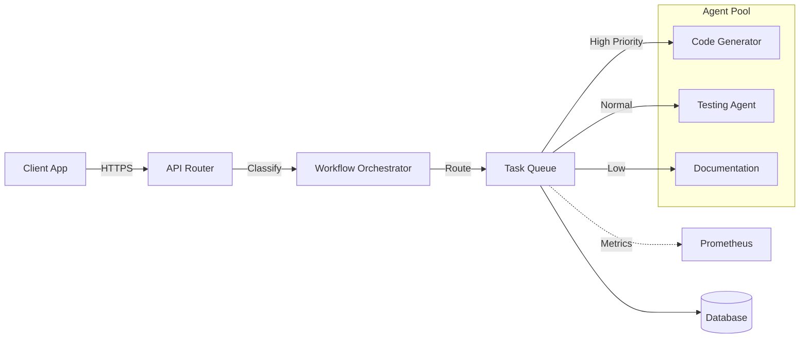

# AI-Powered Multi-Agent Development System

[](https://github.com/anydockerhub/summy/actions)
[](https://opensource.org/licenses/MIT)
[](https://hub.docker.com/r/anydockerhub/summy)
[](https://www.python.org/downloads/)

## Overview

The **AI-Powered Multi-Agent Development System** is a comprehensive, production-grade platform that orchestrates multiple specialized AI agents to automate software development workflows. Built on top of the Intelligent Request Router architecture, this system extends routing capabilities to coordinate nine distinct agent types for code generation, refactoring, testing, bug detection, documentation, migration, DevOps automation, and release management.

By leveraging Qwen2.5 models with strategic model routing, the system efficiently distributes tasks between fast models for classification and powerful models for complex reasoning, ensuring optimal performance and cost-effectiveness.

## Key Features

- **🤖 Multi-Agent Architecture**: Nine specialized agents working in concert to handle complete development lifecycles
- **🧠 Intelligent Task Routing**: Automatic task classification and routing to appropriate agents based on complexity
- **⚡ High Performance**: Asynchronous workflow processing with priority-based task queues
- **🛡️ Production Ready**: Comprehensive error handling, structured logging, and graceful degradation
- **📊 Observability**: Prometheus metrics for agent performance, task throughput, and queue health
- **☁️ Cloud Native**: Fully containerized with Docker, Kubernetes manifests, and HPA support
- **🔄 CI/CD Integrated**: Automated pipelines for testing, building, and deployment
- **🔒 Security First**: OWASP-compliant defaults, input validation, and secure credential handling

## Agent System

### Available Agents

| Agent | Purpose | Model | Use Case |
| :--- | :--- | :--- | :--- |
| **CodeGeneratorAgent** | Generate new code from specifications | qwen2.5-coder | Creating functions, classes, modules |
| **RefactoringAgent** | Improve existing code quality | qwen2.5-coder | Code smell detection, restructuring |
| **CodeViewAgent** | Code exploration and visualization | qwen2.5 | Structure analysis, dependency graphs |
| **TestingAgent** | Automated test generation | qwen2.5-coder | Unit tests, integration tests, mocks |
| **BugDetectionAgent** | Identify defects and vulnerabilities | qwen2.5-coder | Security scans, performance issues |
| **DocumentationAgent** | Generate technical documentation | qwen2.5 | Docstrings, READMEs, API docs |
| **MigrationAgent** | Manage code and DB migrations | qwen2.5 | Schema changes, version upgrades |
| **DevOpsAgent** | Infrastructure automation | qwen2.5 | Dockerfiles, K8s manifests, CI/CD |
| **ReleaseAgent** | Release management and versioning | qwen2.5 | Version bumps, changelogs, tags |

## Architecture



### Component Roles

| Service | Port | Role |
| :--- | :--- | :--- |
| **API Router** | `8000` | Entry point, request parsing, authentication |
| **Workflow Orchestrator** | Internal | Task classification and agent routing |
| **Task Queue** | Internal | Priority-based async task processing |
| **CPU Backend** | `8001` | Lightweight agent tasks, classification |
| **GPU Backend** | `8002` | Complex reasoning, code generation |
| **Database** | `5432` | Task state, results, audit logs |

## Quick Start

### Prerequisites

- Docker & Docker Compose v2.0+
- Python 3.9+ (for local development)
- Make (optional, for convenience commands)

### Deployment with Docker Compose

The fastest way to run the entire stack locally:

```bash
docker compose up -d
```

Verify services are running:
```bash
curl http://localhost:8000/health
# Output: {"status": "healthy", "service": "router"}
```

### Local Development

1. **Clone the repository**:
   ```bash
   git clone https://github.com/anydockerhub/summy.git
   cd summy
   ```

2. **Install dependencies**:
   ```bash
   python -m venv venv
   source venv/bin/activate
   pip install -r requirements.txt
   ```

3. **Initialize database**:
   ```bash
   python -m database.init_db
   ```

4. **Run the orchestrator**:
   ```bash
   python -m workflow.orchestrator
   ```

## Configuration

Environment variables can be set via `.env` file or directly in the shell.

| Variable | Default | Description |
| :--- | :--- | :--- |
| `ROUTING_THRESHOLD` | `100` | Character count threshold for CPU/GPU routing |
| `MAX_WORKERS` | `4` | Maximum concurrent task workers |
| `DEFAULT_MODEL` | `qwen2.5` | Default model for agent operations |
| `DATABASE_URL` | `sqlite:///ai_agent.db` | Database connection string |
| `LOG_LEVEL` | `INFO` | Logging verbosity (`DEBUG`, `INFO`, `WARNING`, `ERROR`) |
| `PROMETHEUS_ENABLED` | `true` | Enable/disable metrics endpoint |
| `TASK_QUEUE_SIZE` | `1000` | Maximum pending tasks in queue |

## Usage Examples

### Code Generation

```python
from backend.agents import CodeGeneratorAgent

agent = CodeGeneratorAgent(model_name="qwen2.5-coder")
result = agent.generate(
    prompt="Create a function to calculate fibonacci numbers",
    context={"language": "python", "style": "functional"}
)
print(result["code"])
```

### Automated Testing

```python
from backend.agents import TestingAgent

agent = TestingAgent(framework="pytest")
code = """
def add(a, b):
    return a + b
"""
tests = agent.generate_tests(code, coverage_target=90.0)
print(tests["test_code"])
```

### Bug Detection

```python
from backend.agents import BugDetectionAgent

agent = BugDetectionAgent(sensitivity="high")
code = """
user_input = request.get('data')
result = eval(user_input)
"""
bugs = agent.scan(code)
print(f"Found {bugs['summary']['total_bugs']} bugs")
```

### DevOps Automation

```python
from backend.agents import DevOpsAgent

agent = DevOpsAgent(platform="kubernetes")
manifests = agent.create_k8s_manifest("my-service", replicas=3)
print(manifests["deployment"])
```

### Workflow Orchestration

```python
from workflow.orchestrator import WorkflowOrchestrator
from workflow.task_queue import TaskQueue, TaskPriority

orchestrator = WorkflowOrchestrator()
queue = TaskQueue(max_workers=4)
queue.start()

# Submit a code generation task
queue.enqueue(
    task_id="task_001",
    payload={
        "type": "code_generate",
        "agent": "CodeGeneratorAgent",
        "prompt": "Create a REST API endpoint",
        "code": ""
    },
    priority=TaskPriority.HIGH
)

# Get result
result = queue.get_result("task_001")
```

## API Reference

### Send Task Request

**Endpoint**: `POST /api/v1/tasks`

**Request**:
```json
{
  "task_type": "code_generate",
  "priority": "high",
  "payload": {
    "prompt": "Create a function to validate email addresses",
    "language": "python"
  }
}
```

**Response**:
```json
{
  "task_id": "task_abc123",
  "status": "queued",
  "estimated_completion_seconds": 5,
  "result_url": "/api/v1/tasks/task_abc123/result"
}
```

### Get Task Result

**Endpoint**: `GET /api/v1/tasks/{task_id}/result`

**Response**:
```json
{
  "task_id": "task_abc123",
  "status": "completed",
  "started_at": "2024-01-15T10:30:00Z",
  "completed_at": "2024-01-15T10:30:05Z",
  "result": {
    "code": "def validate_email(email):...",
    "metadata": {"model": "qwen2.5-coder"}
  }
}
```

### Health Check

**Endpoint**: `GET /health`
Returns `200 OK` if all services and agents are operational.

### Metrics

**Endpoint**: `GET /metrics`
Exposes Prometheus-compatible metrics including:
- `tasks_processed_total`: Total tasks completed by type
- `task_queue_size`: Current pending tasks
- `agent_latency_seconds`: Per-agent processing time
- `routing_decisions_total`: Task classification counts
- `worker_threads_active`: Current worker count

## Database Commands

Use the built-in CLI commands for database management:

```bash
# Run migrations
python -m database.migrate

# Seed test data
python -m database.seed

# Reset database (drops and recreates)
python -m database.reset
```

## Monitoring & Observability

The system exports detailed metrics for integration with Prometheus/Grafana stacks.

**Key Dashboards Panels**:
1. **Agent Performance**: Processing time per agent type
2. **Task Queue Health**: Queue depth, wait times, throughput
3. **Error Rates**: Failures per agent and task type
4. **Resource Utilization**: Worker thread usage, memory consumption

To scrape metrics locally:
```bash
curl http://localhost:8000/metrics
```

## CI/CD Pipeline

This project uses GitHub Actions to automate building and pushing Docker images.

**Workflow Triggers**:
- Push to `main` → Builds `latest` and `<commit-sha>` tags
- Pull Request → Builds `pr-<number>` tag for testing
- Release → Builds versioned tag and publishes

**Secrets Required**:
Configure in GitHub Repository Settings > Secrets:
- `DOCKER_USER`: Docker Hub username
- `DOCKER_PASS`: Docker Hub access token

## Testing

Run the test suite using `pytest`:

```bash
# Run all tests
pytest

# Run with coverage
pytest --cov=backend --cov=workflow --cov-report=html

# Run specific agent tests
pytest tests/test_agents.py -v

# Run integration tests
pytest -m "integration"
```

## Troubleshooting

### Common Issues

**1. Tasks Stuck in Queue**
- Check worker threads: `curl http://localhost:8000/metrics | grep worker`
- Increase `MAX_WORKERS` if queue depth is consistently high
- Verify agents are properly initialized

**2. Agent Import Errors**
- Ensure all dependencies are installed: `pip install -r requirements.txt`
- Check Python version compatibility (3.9+)
- Verify `PYTHONPATH` includes the workspace root

**3. Database Connection Failed**
- Run initialization: `python -m database.init_db`
- Check `DATABASE_URL` environment variable
- Ensure write permissions for SQLite file

**4. High Latency on Code Generation**
- Consider routing to GPU backend for complex tasks
- Adjust `ROUTING_THRESHOLD` based on prompt complexity
- Monitor GPU backend availability

### Debug Commands

```bash
# View task queue status
curl http://localhost:8000/api/v1/queue/status

# Get agent health
curl http://localhost:8000/api/v1/agents/health

# Tail logs
docker compose logs -f orchestrator
```

## Project Structure

```
/workspace
├── backend/
│   └── agents/           # Specialized AI agents
│       ├── __init__.py
│       ├── code_generator_agent.py
│       ├── refactoring_agent.py
│       ├── testing_agent.py
│       ├── bug_detection_agent.py
│       ├── documentation_agent.py
│       ├── migration_agent.py
│       ├── devops_agent.py
│       ├── release_agent.py
│       └── code_view_agent.py
├── workflow/
│   ├── orchestrator.py   # Task orchestration logic
│   └── task_queue.py     # Priority queue implementation
├── core/
│   ├── proxy.py          # Request router
│   ├── config.py         # Configuration management
│   ├── database.py       # Database utilities
│   └── metrics.py        # Prometheus metrics
├── database/
│   ├── schema.sql        # Database schema
│   └── init_db.py        # Initialization script
├── api/
│   ├── router.py         # API endpoints
│   └── models.py         # Pydantic models
├── cli/
│   └── optimized_cli.py  # Command-line interface
├── scripts/
│   ├── verify.sh         # Verification script
│   ├── smoke_test.sh     # Smoke tests
│   └── rollback.sh       # Rollback procedures
├── tests/
│   ├── test_proxy.py
│   ├── test_agents.py
│   └── test_workflow.py
├── docs/                 # Documentation
├── deployment/           # Docker & K8s configs
├── monitoring/           # Logging & metrics
└── prompts/              # Agent prompt templates
```

## License

This project is licensed under the MIT License - see the [LICENSE](LICENSE) file for details.

## Contributing

Contributions are welcome! Please read our [Contributing Guidelines](CONTRIBUTING.md) first.

1. Fork the repository
2. Create a feature branch (`git checkout -b feature/amazing-feature`)
3. Commit your changes (`git commit -m 'Add some amazing feature'`)
4. Push to the branch (`git push origin feature/amazing-feature`)
5. Open a Pull Request

## Security

See [SECURITY.md](SECURITY.md) for security policies and reporting procedures.

---
*Built with ❤️ by the Summy Team - Empowering developers with AI-driven automation*
